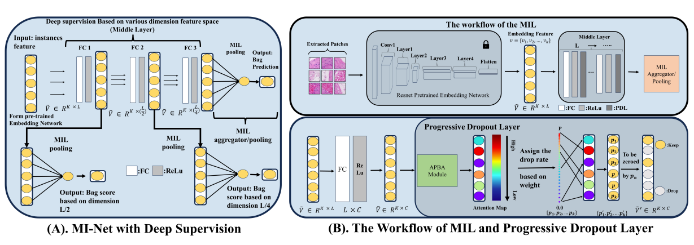
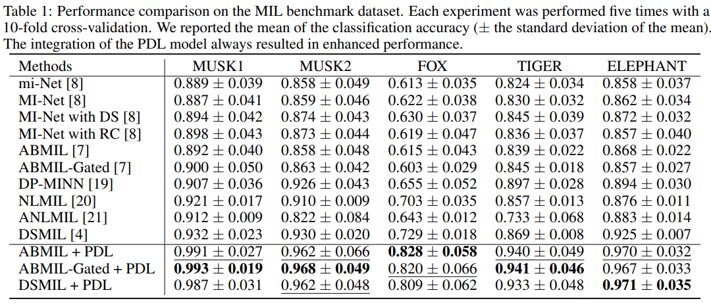

# PDL: Regularizing Multiple Instance Learning with Progressive Dropout Layers

### [PDL: Regularizing Multiple Instance Learning with Progressive Dropout Layers](https://arxiv.org/pdf/2308.10112.pdf)

**Abstract** 
Multiple instance learning (MIL) was a weakly supervised learning approach that sought to assign binary class labels to collections of instances known as bags. However, due to their weak supervision nature, the MIL methods were susceptible to overfitting and required assistance in developing comprehensive representations of target instances. While regularization typically effectively combated overfitting, its integration with the MIL model has been frequently overlooked in prior studies. Meanwhile, current regularization methods for MIL have shown limitations in their capacity to uncover a diverse array of representations. In this study, we delve into the realm of regularization within the MIL model, presenting a novel approach in the form of a Progressive Dropout Layer (PDL). We aim to not only address overfitting but also empower the MIL model in uncovering intricate and impactful feature representations. The proposed method was orthogonal to existing MIL methods and could be easily integrated into them to boost performance. Our extensive evaluation across a range of MIL benchmark datasets demonstrated that the incorporation of the PDL into multiple MIL methods not only elevated their classification performance but also augmented their potential for weakly-supervised feature localizations.

**Framework** 

**Experiment Result**

